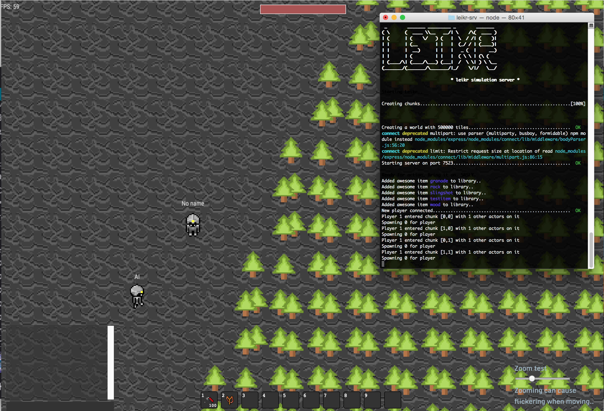

leikr-srv
=========

This was an experiment playing with different things such as map streaming, maintaining real-time visibility lists, and dealing with very large maps with a large amount of active entities.

There might be some half-useful stuff in the node part (such as the code dealing with visibility lists).

Tilesets borrowed from [https://github.com/cvasseng/craftonauts](https://github.com/cvasseng/craftonauts)

# Running

First install dependencies: `npm install`

Run with `node bin/leikr-srv` defaults to port `7523`, so check out `http://127.0.0.1:7523` once it's running.

# License
MIT.
